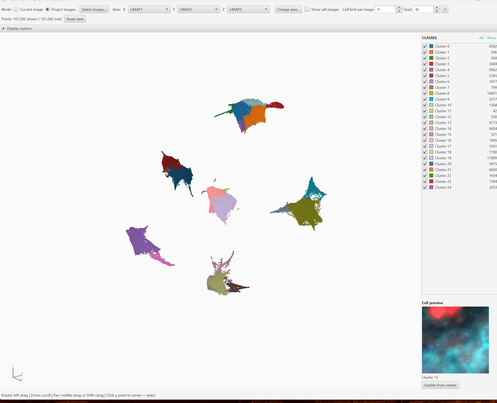

# Cluster 3D Navigator

An interactive **3D point cloud of your clustered cells** inside QuPath. One point per
detection, colored by its classification (PathClass). Rotate, zoom, and pan the cloud, then
**click a point to select and center that cell in the QuPath viewer** -- an interesting spot
in cluster space becomes the actual cell on the slide in one click.

- Version: 0.1.0
- License: **GPL-3.0-or-later** -- links GPLv3 QuPath core (and adapts code from Apache-2.0
  QP-CAT, which is GPL-compatible). The GPL driver is the QuPath link, not QP-CAT. The shared
  3D viewer lives in the separate Apache-2.0 `cluster3d-core` library; this repo is a thin GPL
  shell that shades it in. A definitive license-check is run at the release gate.
- **Reads detections only; writes nothing to the hierarchy.** Navigation selects existing cells.

## What it is / who it is for

For scientists, grad students, and PIs who have **already clustered cells** (with any tool)
and want to explore cluster structure in 3D and navigate back to the real cells. If your
detections carry a class and at least three numeric measurement columns, this tool plots
them.

## How it relates to QP-CAT

QP-CAT ships a **2D** embedding scatter and a **one-way** "Export for VEST" (opens in a
browser, cannot navigate back). Cluster 3D Navigator is the complementary **in-QuPath,
bidirectional (click-to-navigate) 3D** tool, and it is **generic** -- it works with the
output of any clustering tool, not just QP-CAT. Use either or both.

## Requirements

- QuPath 0.7+
- An image (or project) whose detections carry a **PathClass** and **at least 3 numeric
  measurement columns** (for example `UMAP1`, `UMAP2`, `UMAP3`).
- No Python, no browser, no network, no heavy download. Pure Java.

## Install

### Catalog (preferred)

Add the `qupath-catalog-mikenelson` catalog in QuPath's Extension Manager, then install
"Cluster 3D Navigator". Updates arrive through the catalog.

### Manual jar (fallback)

Download `qupath-extension-cluster-3d-navigator-0.1.0-all.jar` from Releases, drop it into
`~/QuPath/v0.7/extensions/` (Linux) or the equivalent on Windows, and restart QuPath.

### Platform caveat

**Verified on Linux only** for this build (compile + unit tests + WSL rendering). **Windows**
is a claimed target that still needs real verification (HiDPI pointer mapping, native window
chrome, dark-theme appearance). **macOS is not verified.**

## Quick start

1. Open an image in QuPath that already has clustered cells -- detections that carry a
   **classification (PathClass)** and at least **three numeric measurement columns**
   (for example `UMAP1`, `UMAP2`, `UMAP3`). Any clustering tool that produces these works.
2. Choose **Extensions > Cluster 3D Navigator > Open 3D navigator...**.
3. If your data has recognizable embedding columns (UMAP/PCA/tSNE), the navigator preselects
   them; otherwise pick which three measurements to use as the X, Y, and Z axes.
4. **Drag to rotate**, **scroll to zoom**, **middle-drag (or Shift+drag) to pan** the colored
   point cloud. Each point is one cell; its color is its class.
5. **Click a point to jump to the cell** (and see its crop in the Cell preview panel). To
   preview on hover instead, enable "Preview crop on hover" in Display options.

## What you'll see

A rotatable colored cloud on the left, a class legend with per-class checkboxes and a Cell
preview thumbnail on the right, and a gesture cheat-sheet along the bottom. The title bar
shows the active image so you always know what the cloud is bound to.

## Documentation

- [User guide](documentation/user-guide.md) -- axis selection, navigation, class toggling,
  project-wide mode, settings, troubleshooting.
- [Developer guide](documentation/developer-guide.md) -- building from source, architecture,
  the generic input contract.

## Issues / contributions

File bugs on GitHub. Please include your QuPath version, OS, roughly how many cells, and
which measurements you plotted.

## Inspiration / prior art

The click-to-explore idea is inspired by **VEST** ([scads/vest](https://github.com/scads/vest),
MIT license), a browser-based tool for "travelling" through a 3D embedding of cells. Cluster
3D Navigator mirrors that click-to-explore concept **natively inside QuPath** so a point in
embedding space maps back to the real cell on the slide. We deliberately do **not** embed VEST
itself -- a browser page cannot drive the QuPath viewer -- and a one-way "Export to VEST"
bundle is planned (see the user guide's *Planned / not yet available*).

## Architecture and attribution

The 3D viewer lives in the separate **Apache-2.0** library `cluster3d-core` (package
`qupath.ext.cluster3d`); this repo is a thin GPL shell (menu entry + a Stage wrapping the core
`Cluster3DNavigatorPane`). Within core, the viewer navigation, per-cell crop preview, cell
back-reference model, the reusable project-image subset picker, and the Canvas interaction idioms
(transform, zoom-at-cursor, throttled hover, stale-crop discard) are **Apache-2.0 adaptations of
QP-CAT** (`qupath-extension-cell-analysis-tools`, Apache-2.0). QP-CAT is credited in the core
source headers and in `cluster3d-core/NOTICE`.
